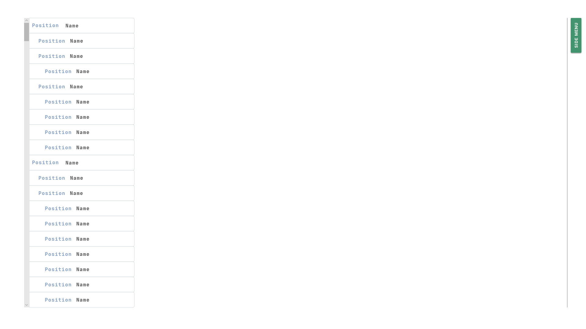
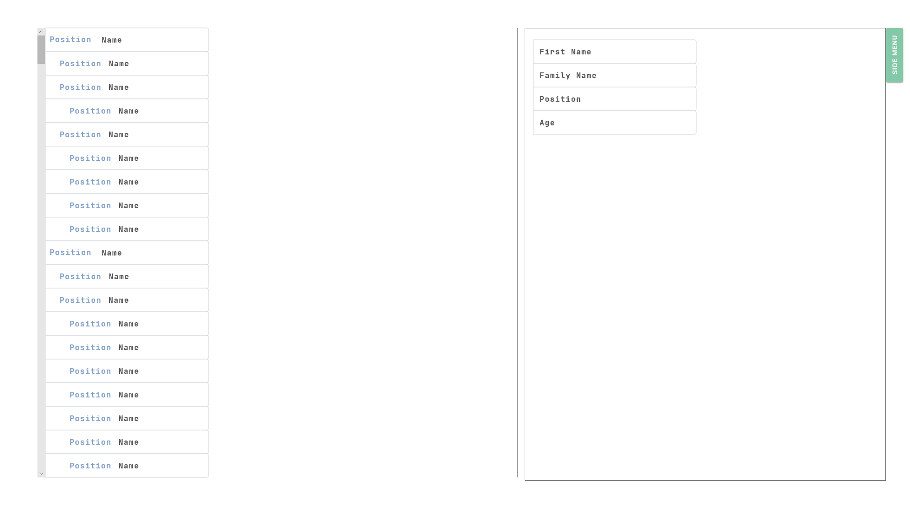

# angular13-simple-employee-hierarchy

## Content
1. Content
2. Task
3. Conditions

## Task
The following is an imaginary customer request. 

### Situation
One of our customers wants to get a view integrated, which displays the employees of the company. 
We will retrieve the employee data over REST API from a 3rd party management tool and our backend developers are currently specifing the details regarding the API. In the meantime one of our senior developers created two mockups in a meeting with our customer and you have to implement a prototype according to those mockups. Further details in the user story section.

### User stories
1. As a developer I want a list of my fellow employees of my company.
2. As a developer I want to know who is in charge / who manages which employee. 
3. As a developer I don't want to scroll up to see the manager. 
4. As a developer I want a detail page which shows more details about an employee. 
5. As a developer I don't want the details page visible all the time. 

### Mockups

On the left a tree list with the employees. Displayed information are position and Name. On the right a button for a side menu. 

If the button is pressed, a view expands with details about the employee.

### Data
- First Name
- Last Name
- Position
- Birthdate
- Manager

### Specifications
- Colors
  - Button not pressed: #41946D
  - Button pressed: #83C9A8
  - Font in Button: #F5F5F5
  - Normal Font: #262626
  - Position Font in list: #83A1C9
- Font
  - JetBrains Mono Bold - 16pt

### Required Testdata 
You have to define test data according to the data section. Create at least 30 employees.

### Task 1
Implement the view according to the mockups, data and specifications sections and user stories 1, 2 and 4.

### Task 2
Implement the details funcitonality according to user story 5.

### Task 3
Implement the sticky header functionality according to user story 3.

## Conditions
- Try your best to fulfill the task according to the description
- Complete the task & double check the requirements 
- If possible, write tests
